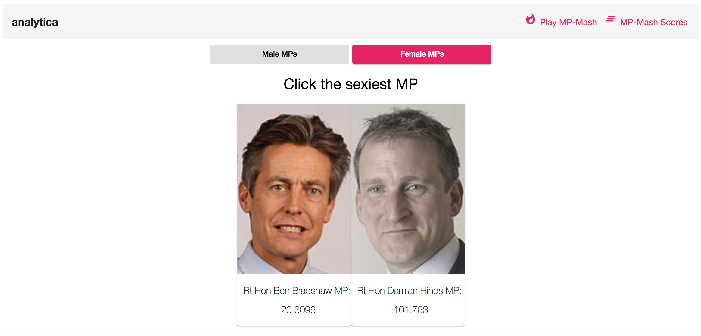
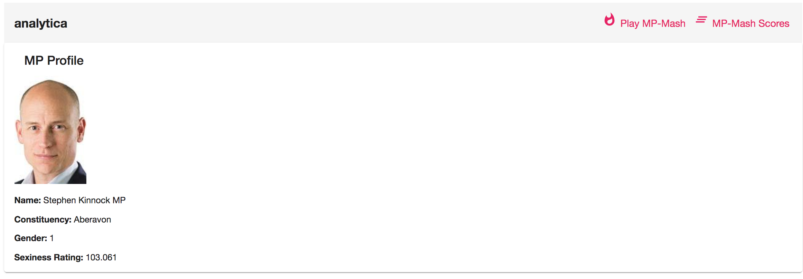

# Hottest MP

This project was generated with [Angular CLI](https://github.com/angular/angular-cli) version 8.1.1. Material, RxJS, PHP API, MySQL DB, Algorithm. (Uses my crude MP data API for back-end: obviously wouldn't use such a simple setup for any real-life production: <a  href="https://github.com/k1n4kut4/analytica_api">https://github.com/k1n4kut4/analytica_api</a>.)

I was intrigued by the scene in the movie Social Network in which Eduardo Saverin, then a friend of Facebook founder Mark Zuckerberg, writes an Elo rating algorithm on the window of a Havard dorm.  

## MP "FaceMash" - filter: M

## MP "FaceMash" - filter: F

## Scoreboard

## MP Profile

### Inspiration

Zuckerberg created <a href="https://en.wikipedia.org/wiki/History_of_Facebook">FaceMash</a>. The website was set up as a type of "hot or not" game for Harvard students, which placed two pictures side-by-side and thus let the user decide who was hot or not.    

    

Therefore, I decided to implement this algorithm.

  

The algorithm in the film is actually incorrect - it should be:  
Ea = 1/(1+10((Rb-Ra)/400))   
Eb = 1/(1+10((Ra-Rb)/400)) 

For ethical reasons, I didn't want to copy Zuckerberg's choice of subject - he uploaded photos of fellow students. Instead, I have used photos of popular swimwear/lingerie models - the repo BabeMash. <a href="https://github.com/k1n4kut4/facesmash">https://github.com/k1n4kut4/babemash</a> 
  
Here is my ealier JavaScript code for FaceMash: <a href="https://github.com/k1n4kut4/facesmash">https://github.com/k1n4kut4/facesmash</a>   

## Development server

Run `ng serve` for a dev server. Navigate to `http://localhost:4200/`. The app will automatically reload if you change any of the source files.

## Code scaffolding

Run `ng generate component component-name` to generate a new component. You can also use `ng generate directive|pipe|service|class|guard|interface|enum|module`.

## Build

Run `ng build` to build the project. The build artifacts will be stored in the `dist/` directory. Use the `--prod` flag for a production build.

## Running unit tests

Run `ng test` to execute the unit tests via [Karma](https://karma-runner.github.io).

## Running end-to-end tests

Run `ng e2e` to execute the end-to-end tests via [Protractor](http://www.protractortest.org/).

## Further help

To get more help on the Angular CLI use `ng help` or go check out the [Angular CLI README](https://github.com/angular/angular-cli/blob/master/README.md).
